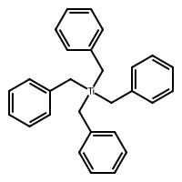

# SMILES to

Powered by [RDKit](https://github.com/rdkit/rdkit) 

## Usage

```
conda install -c conda-forge rdkit
```

```
python main.py
```

---
Options:
1. Convert SMILES to PDB (3D)
2. Convert SMILES to PDB (2D)
3. Convert SMILES to MOL (3D)
4. Convert SMILES to MOL (2D)
5. Convert SMILES to PNG (2D)
6. Exit
---

## Demo

<details>
    <summary>PDB</summary>

```
HETATM    1  C1  UNL     1       1.331  -1.070  -1.935  1.00  0.00           C  
HETATM    2 TI1  UNL     1       0.546   0.265  -0.454  1.00  0.00          TI  
HETATM    3  C2  UNL     1      -0.769  -0.699   0.883  1.00  0.00           C  
HETATM    4  C3  UNL     1      -1.746  -1.605   0.283  1.00  0.00           C  
HETATM    5  C4  UNL     1      -1.453  -2.953   0.053  1.00  0.00           C  
HETATM    6  C5  UNL     1      -2.372  -3.814  -0.510  1.00  0.00           C  
HETATM    7  C6  UNL     1      -3.621  -3.347  -0.862  1.00  0.00           C  
HETATM    8  C7  UNL     1      -3.952  -2.010  -0.650  1.00  0.00           C  
HETATM    9  C8  UNL     1      -3.000  -1.190  -0.085  1.00  0.00           C  
HETATM   10  C9  UNL     1      -0.350   1.978  -1.318  1.00  0.00           C  
HETATM   11  C10 UNL     1      -1.818   2.040  -1.198  1.00  0.00           C  
HETATM   12  C11 UNL     1      -2.366   2.644  -0.084  1.00  0.00           C  
HETATM   13  C12 UNL     1      -3.747   2.701   0.001  1.00  0.00           C  
HETATM   14  C13 UNL     1      -4.575   2.183  -0.977  1.00  0.00           C  
HETATM   15  C14 UNL     1      -4.025   1.574  -2.100  1.00  0.00           C  
HETATM   16  C15 UNL     1      -2.631   1.508  -2.200  1.00  0.00           C  
HETATM   17  C16 UNL     1       2.246   0.924   0.721  1.00  0.00           C  
HETATM   18  C17 UNL     1       1.697   1.383   2.028  1.00  0.00           C  
HETATM   19  C18 UNL     1       1.298   2.690   2.248  1.00  0.00           C  
HETATM   20  C19 UNL     1       0.788   3.109   3.467  1.00  0.00           C  
HETATM   21  C20 UNL     1       0.677   2.179   4.498  1.00  0.00           C  
HETATM   22  C21 UNL     1       1.064   0.867   4.316  1.00  0.00           C  
HETATM   23  C22 UNL     1       1.574   0.488   3.069  1.00  0.00           C  
HETATM   24  C23 UNL     1       2.757  -1.415  -1.690  1.00  0.00           C  
HETATM   25  C24 UNL     1       3.722  -0.592  -2.265  1.00  0.00           C  
HETATM   26  C25 UNL     1       5.044  -0.880  -2.056  1.00  0.00           C  
HETATM   27  C26 UNL     1       5.468  -1.965  -1.290  1.00  0.00           C  
HETATM   28  C27 UNL     1       4.502  -2.761  -0.735  1.00  0.00           C  
HETATM   29  C28 UNL     1       3.145  -2.501  -0.924  1.00  0.00           C  
HETATM   30  H1  UNL     1       1.265  -0.605  -2.934  1.00  0.00           H  
HETATM   31  H2  UNL     1       0.759  -2.028  -1.886  1.00  0.00           H  
HETATM   32  H3  UNL     1      -1.319   0.079   1.459  1.00  0.00           H  
HETATM   33  H4  UNL     1      -0.198  -1.297   1.642  1.00  0.00           H  
HETATM   34  H5  UNL     1      -0.469  -3.301   0.336  1.00  0.00           H  
HETATM   35  H6  UNL     1      -2.128  -4.835  -0.675  1.00  0.00           H  
HETATM   36  H7  UNL     1      -4.359  -4.009  -1.307  1.00  0.00           H  
HETATM   37  H8  UNL     1      -4.940  -1.680  -0.939  1.00  0.00           H  
HETATM   38  H9  UNL     1      -3.245  -0.154   0.087  1.00  0.00           H  
HETATM   39  H10 UNL     1       0.083   2.901  -0.867  1.00  0.00           H  
HETATM   40  H11 UNL     1      -0.084   2.071  -2.411  1.00  0.00           H  
HETATM   41  H12 UNL     1      -1.726   3.055   0.691  1.00  0.00           H  
HETATM   42  H13 UNL     1      -4.208   3.170   0.865  1.00  0.00           H  
HETATM   43  H14 UNL     1      -5.656   2.226  -0.915  1.00  0.00           H  
HETATM   44  H15 UNL     1      -4.661   1.165  -2.870  1.00  0.00           H  
HETATM   45  H16 UNL     1      -2.198   1.041  -3.062  1.00  0.00           H  
HETATM   46  H17 UNL     1       2.782   1.733   0.214  1.00  0.00           H  
HETATM   47  H18 UNL     1       2.865   0.020   0.884  1.00  0.00           H  
HETATM   48  H19 UNL     1       1.379   3.423   1.453  1.00  0.00           H  
HETATM   49  H20 UNL     1       0.470   4.117   3.665  1.00  0.00           H  
HETATM   50  H21 UNL     1       0.285   2.483   5.449  1.00  0.00           H  
HETATM   51  H22 UNL     1       0.976   0.142   5.124  1.00  0.00           H  
HETATM   52  H23 UNL     1       1.894  -0.546   2.881  1.00  0.00           H  
HETATM   53  H24 UNL     1       3.452   0.264  -2.869  1.00  0.00           H  
HETATM   54  H25 UNL     1       5.797  -0.257  -2.491  1.00  0.00           H  
HETATM   55  H26 UNL     1       6.525  -2.150  -1.155  1.00  0.00           H  
HETATM   56  H27 UNL     1       4.829  -3.616  -0.131  1.00  0.00           H  
HETATM   57  H28 UNL     1       2.396  -3.145  -0.474  1.00  0.00           H  
CONECT    1    2   24   30   31
CONECT    2    3   10   17
CONECT    3    4   32   33
CONECT    4    5    5    9
CONECT    5    6   34
CONECT    6    7    7   35
CONECT    7    8   36
CONECT    8    9    9   37
CONECT    9   38
CONECT   10   11   39   40
CONECT   11   12   12   16
CONECT   12   13   41
CONECT   13   14   14   42
CONECT   14   15   43
CONECT   15   16   16   44
CONECT   16   45
CONECT   17   18   46   47
CONECT   18   19   19   23
CONECT   19   20   48
CONECT   20   21   21   49
CONECT   21   22   50
CONECT   22   23   23   51
CONECT   23   52
CONECT   24   25   25   29
CONECT   25   26   53
CONECT   26   27   27   54
CONECT   27   28   55
CONECT   28   29   29   56
CONECT   29   57
END
```

 </details>


 <details>
    <summary>MOL</summary>

```

     RDKit          3D

 57 60  0  0  0  0  0  0  0  0999 V2000
   -1.4830    2.2399    0.1876 C   0  0  0  0  0  0  0  0  0  0  0  0
   -0.1734    0.5496    0.1734 Ti  0  0  0  0  0  4  0  0  0  0  0  0
   -0.7193   -0.9121    1.6006 C   0  0  0  0  0  0  0  0  0  0  0  0
   -0.8857   -0.3949    2.9775 C   0  0  0  0  0  0  0  0  0  0  0  0
    0.1562   -0.3463    3.8815 C   0  0  0  0  0  0  0  0  0  0  0  0
    0.0202    0.1322    5.1686 C   0  0  0  0  0  0  0  0  0  0  0  0
   -1.1993    0.5919    5.6074 C   0  0  0  0  0  0  0  0  0  0  0  0
   -2.2670    0.5572    4.7245 C   0  0  0  0  0  0  0  0  0  0  0  0
   -2.1158    0.0778    3.4461 C   0  0  0  0  0  0  0  0  0  0  0  0
    1.8430    1.2311    0.4360 C   0  0  0  0  0  0  0  0  0  0  0  0
    2.8202    0.1909    0.0997 C   0  0  0  0  0  0  0  0  0  0  0  0
    3.2937    0.0975   -1.2130 C   0  0  0  0  0  0  0  0  0  0  0  0
    4.2238   -0.8810   -1.5657 C   0  0  0  0  0  0  0  0  0  0  0  0
    4.7022   -1.7870   -0.6197 C   0  0  0  0  0  0  0  0  0  0  0  0
    4.2315   -1.6936    0.6835 C   0  0  0  0  0  0  0  0  0  0  0  0
    3.3134   -0.7236    1.0203 C   0  0  0  0  0  0  0  0  0  0  0  0
   -0.2820   -0.3615   -1.7725 C   0  0  0  0  0  0  0  0  0  0  0  0
   -0.5921   -1.8094   -1.6959 C   0  0  0  0  0  0  0  0  0  0  0  0
   -1.9020   -2.2857   -1.7079 C   0  0  0  0  0  0  0  0  0  0  0  0
   -2.1081   -3.6444   -1.6335 C   0  0  0  0  0  0  0  0  0  0  0  0
   -1.0459   -4.5511   -1.5469 C   0  0  0  0  0  0  0  0  0  0  0  0
    0.2475   -4.0828   -1.5349 C   0  0  0  0  0  0  0  0  0  0  0  0
    0.4409   -2.7212   -1.6099 C   0  0  0  0  0  0  0  0  0  0  0  0
   -1.6145    2.8108   -1.1842 C   0  0  0  0  0  0  0  0  0  0  0  0
   -0.7617    3.8021   -1.6549 C   0  0  0  0  0  0  0  0  0  0  0  0
   -0.8793    4.3339   -2.9240 C   0  0  0  0  0  0  0  0  0  0  0  0
   -1.8836    3.8728   -3.7796 C   0  0  0  0  0  0  0  0  0  0  0  0
   -2.7366    2.8892   -3.3248 C   0  0  0  0  0  0  0  0  0  0  0  0
   -2.6109    2.3644   -2.0550 C   0  0  0  0  0  0  0  0  0  0  0  0
   -2.5107    2.0015    0.5168 H   0  0  0  0  0  0  0  0  0  0  0  0
   -1.0276    3.0519    0.7984 H   0  0  0  0  0  0  0  0  0  0  0  0
   -1.6107   -1.4643    1.2458 H   0  0  0  0  0  0  0  0  0  0  0  0
    0.1093   -1.6594    1.6325 H   0  0  0  0  0  0  0  0  0  0  0  0
    1.1427   -0.6926    3.6008 H   0  0  0  0  0  0  0  0  0  0  0  0
    0.8531    0.1567    5.8497 H   0  0  0  0  0  0  0  0  0  0  0  0
   -1.2815    0.9619    6.6193 H   0  0  0  0  0  0  0  0  0  0  0  0
   -3.2119    0.9322    5.1191 H   0  0  0  0  0  0  0  0  0  0  0  0
   -2.9813    0.0736    2.8000 H   0  0  0  0  0  0  0  0  0  0  0  0
    1.9187    1.6216    1.4738 H   0  0  0  0  0  0  0  0  0  0  0  0
    1.9648    2.1141   -0.2562 H   0  0  0  0  0  0  0  0  0  0  0  0
    2.9497    0.7818   -1.9852 H   0  0  0  0  0  0  0  0  0  0  0  0
    4.5954   -0.9553   -2.5931 H   0  0  0  0  0  0  0  0  0  0  0  0
    5.4253   -2.5565   -0.8693 H   0  0  0  0  0  0  0  0  0  0  0  0
    4.6203   -2.4090    1.3940 H   0  0  0  0  0  0  0  0  0  0  0  0
    2.9697   -0.6811    2.0437 H   0  0  0  0  0  0  0  0  0  0  0  0
   -1.0822    0.1015   -2.4067 H   0  0  0  0  0  0  0  0  0  0  0  0
    0.6486   -0.2668   -2.3471 H   0  0  0  0  0  0  0  0  0  0  0  0
   -2.7376   -1.5812   -1.7755 H   0  0  0  0  0  0  0  0  0  0  0  0
   -3.1061   -4.0418   -1.6405 H   0  0  0  0  0  0  0  0  0  0  0  0
   -1.2314   -5.6289   -1.4885 H   0  0  0  0  0  0  0  0  0  0  0  0
    1.0810   -4.7861   -1.4675 H   0  0  0  0  0  0  0  0  0  0  0  0
    1.4527   -2.3407   -1.6014 H   0  0  0  0  0  0  0  0  0  0  0  0
    0.0391    4.1857   -1.0045 H   0  0  0  0  0  0  0  0  0  0  0  0
   -0.2319    5.1031   -3.3146 H   0  0  0  0  0  0  0  0  0  0  0  0
   -1.9733    4.2921   -4.7750 H   0  0  0  0  0  0  0  0  0  0  0  0
   -3.5152    2.5441   -4.0127 H   0  0  0  0  0  0  0  0  0  0  0  0
   -3.3014    1.5950   -1.7403 H   0  0  0  0  0  0  0  0  0  0  0  0
  1  2  1  0
  2  3  1  0
  3  4  1  0
  4  5  2  0
  5  6  1  0
  6  7  2  0
  7  8  1  0
  8  9  2  0
  2 10  1  0
 10 11  1  0
 11 12  2  0
 12 13  1  0
 13 14  2  0
 14 15  1  0
 15 16  2  0
  2 17  1  0
 17 18  1  0
 18 19  2  0
 19 20  1  0
 20 21  2  0
 21 22  1  0
 22 23  2  0
  1 24  1  0
 24 25  2  0
 25 26  1  0
 26 27  2  0
 27 28  1  0
 28 29  2  0
  9  4  1  0
 16 11  1  0
 23 18  1  0
 29 24  1  0
  1 30  1  0
  1 31  1  0
  3 32  1  0
  3 33  1  0
  5 34  1  0
  6 35  1  0
  7 36  1  0
  8 37  1  0
  9 38  1  0
 10 39  1  0
 10 40  1  0
 12 41  1  0
 13 42  1  0
 14 43  1  0
 15 44  1  0
 16 45  1  0
 17 46  1  0
 17 47  1  0
 19 48  1  0
 20 49  1  0
 21 50  1  0
 22 51  1  0
 23 52  1  0
 25 53  1  0
 26 54  1  0
 27 55  1  0
 28 56  1  0
 29 57  1  0
M  END
```

 </details>

 <details>
    <summary>PNG</summary>



 </details>